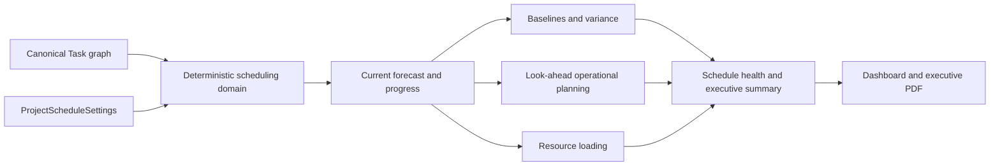
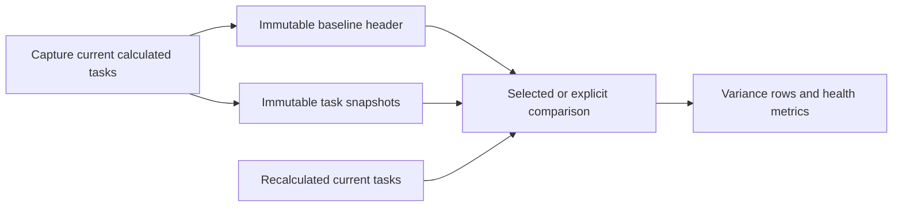
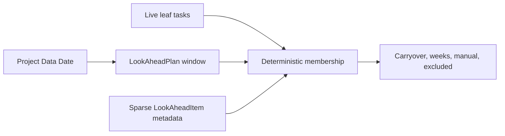
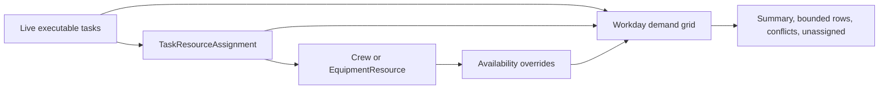
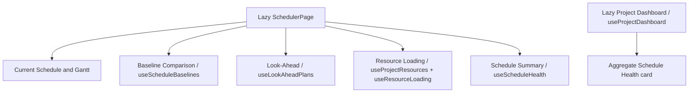

# Advanced Scheduling

M17 completes FieldFlow's project-owned scheduling platform. One canonical
`Task` graph drives current forecasts, immutable baseline comparisons,
look-ahead field planning, resource loading, dashboard health, and bounded
reports. The system does not maintain a second analytics schedule.

Focused contracts remain in [Scheduling](SCHEDULING.md),
[Baselines](SCHEDULE_BASELINES.md), [Progress](SCHEDULE_PROGRESS.md),
[Look-Ahead Planning](LOOK_AHEAD_PLANNING.md), and
[Resource Planning](RESOURCE_PLANNING.md).

## Capability Inventory

| Phase | Shipped capability |
|---|---|
| M17.1 | Persistent Schedule Start Date, deterministic recalculation, hierarchy-safe reorder, summary rollups, strict nullability, indexes, and scale budgets |
| M17.2 | Immutable project baselines and task snapshots, explicit comparison selection, variance, critical changes, added/removed tasks, and structural flags |
| M17.3 | Persistent Data Date, normalized progress, actual dates, remaining duration, out-of-sequence detection, progress-aware forecast/variance, and PDF progress |
| M17.4 | Milestones, normalized multiple predecessors, FS/SS/FF/SF, signed lag, eight constraint types, and advanced Gantt relationships |
| M17.5 | Live 21-42 day look-ahead plans, readiness, blockers, commitments, carryover, weekly groups, overrides, company responsibility, archive, and print |
| M17.6 | Crews, equipment, whole-number task allocations, availability overrides, over-allocation, unavailable conflicts, unassigned tasks, resource labels, and print |
| M17.7 | Explainable schedule health, executive summary/PDF, dashboard health, a fifth Schedule Summary mode, and bounded large responses |

Deferred capabilities include resource leveling, cost loading, earned value,
configurable calendars, schedule virtualization, historical commitment or
progress ledgers, and server PDFs for look-ahead/resource views. AI scheduling,
employee records, and automatic rescheduling are not supported. Live browser,
cross-browser, print, PDF-download, and production query-plan checks remain
production-unverified.

## Architecture

Schedule mutations lock the project schedule, validate project-scoped IDs,
recalculate in the same transaction, commit once, and roll back on failure.
Health and reports are read-only derivations. The dashboard calls the same
health service inside its existing aggregate request; the Schedule Summary
uses the focused health route on demand.

## Schedule Health

`app.services.schedule_health` is the single policy module. There is no score,
weighting, machine learning, or hidden grade. The response returns the
category, factual reasons, all metric values, threshold metadata, baseline and
Data Date context, an executive summary, and at most ten attention items.
Reasons are deterministic and capped at ten.

| Category | Deterministic rule |
|---|---|
| `critical` | Forecast finish is at least 10 workdays late; or any negative float, mandatory constraint violation, unavailable-resource conflict, or blocked critical look-ahead item exists |
| `attention` | Any lesser finish slip, missing comparison baseline, slipped/newly critical/out-of-sequence/overdue incomplete work, blocked or overdue look-ahead blocker, over-allocation, unassigned executable task, or milestone variance exists |
| `stable` | No critical or attention rule is active and a comparison baseline is available |

Missing baseline is explicitly `attention`; it never produces a misleading
healthy comparison. Dates use the project Data Date and ISO `YYYY-MM-DD`
contract. Summary tasks are excluded from leaf-task totals.

## Health Contract

`GET /projects/{project_id}/schedule-health` accepts optional `baseline_id`.
It returns:

- `category`, `summary`, bounded `reasons`, and explicit `thresholds`;
- factual `metrics` for variance, criticality, progress exceptions,
  constraints, look-ahead, resources, and milestones;
- selected/explicit baseline and project schedule-date context;
- `executive_summary` with separate labor/equipment conflicts and explicit
  workday units;
- at most ten `top_attention_items`, each with severity, source, task ID when
  applicable, safe title/WBS, factual reason, and the supported Schedule target.

The same schema appears as `schedule_health` in
`GET /projects/{project_id}/dashboard`. The dashboard still makes one aggregate
request and receives no task, look-ahead, resource, attachment, or report
collection.

## Reporting

`GET /projects/{project_id}/reports/schedule-executive.pdf` accepts optional
`baseline_id`. It uses the shared health result and existing ReportLab
hardening: escaped user text, no external resources, bounded sections,
ASCII-safe filename, authenticated ownership, and temporary-file cleanup on
success and failure. It does not mutate schedule state or dump every task.

The existing `GET /projects/{project_id}/export/pdf` remains the detailed
current schedule report. Look-Ahead and Resource Loading remain local,
print-specific browser views. The UI names these controls explicitly and does
not expose a generic report builder.

## API Inventory

Every route requires authentication and `get_owned_project`; nested IDs are
resolved inside that project. Request models reject unknown and ownership
fields. Common errors are 401 unauthenticated, 403 foreign project, 404 missing
nested record, 409 lifecycle/conflict, and 422 invalid input.

| Area | Routes and purpose |
|---|---|
| Settings | `GET/PUT /projects/{project_id}/schedule-settings` reads or updates Schedule Start/Data Date |
| Tasks | `GET/POST /projects/{project_id}/tasks`; `PUT/DELETE /projects/{project_id}/tasks/{task_id}`; `PUT .../tasks/reorder`; `PUT .../tasks/{task_id}/progress`; planning uses the task update contract |
| Templates | Project template list/create/apply routes preserve planning and dependency compatibility |
| Baselines | `POST/GET .../schedule-baselines`; `GET/POST .../schedule-baselines/{baseline_id}` detail/archive; `PUT .../schedule-baseline-comparison`; `GET .../schedule-variance` with bounded filters/pagination |
| Look-ahead | `POST/GET .../look-ahead-plans`; `GET/PUT .../look-ahead-plans/{plan_id}`; `POST .../{plan_id}/archive`; `PUT .../{plan_id}/items/{task_id}` |
| Resources | Project crew/equipment CRUD and archive; task assignment GET/POST/PUT/DELETE; typed availability GET/POST/PUT/DELETE; `GET .../resource-loading` with a 90-day range and 200-row limit |
| Health/dashboard | `GET .../schedule-health`; `GET .../dashboard` with bounded health |
| Reports | `GET .../export/pdf`; `GET .../reports/schedule-executive.pdf` |

## Data Model Inventory

| Model | Ownership and lifecycle |
|---|---|
| `ProjectScheduleSettings` | One row per project; stores Schedule Start, Data Date, and selected comparison baseline |
| `Task` | Stable project-owned ID; stored inputs/progress plus recalculated forecast/float; hierarchy and dependency compatibility fields |
| `TaskDependency` | Project/task/predecessor normalized edge with FS/SS/FF/SF and signed lag; cascades with task/project |
| `ScheduleBaseline` | Immutable project header; active/archived lifecycle and unique project/name |
| `ScheduleBaselineTask` | Immutable calculated task snapshot bounded by its baseline |
| `LookAheadPlan` | Project-owned active/archived live planning window |
| `LookAheadItem` | Sparse plan/task operational metadata; task ID remains historical if the live task is deleted |
| `Crew`, `EquipmentResource` | Project-owned stable resource IDs with active/archived lifecycle |
| `TaskResourceAssignment` | Project/task-owned typed reference to exactly one crew or equipment record |
| `ResourceAvailability` | Project/resource-owned dated capacity override with ordered ranges |

The M17 migration chain is
`f6a1c9d3e742 -> a2c7e9f4b610 -> c8d4f1a7b903 -> d4e8a1c7f925 -> e6b4c9a2d715 -> f7c5d0b3e826`.
M17.7 adds no persistence and creates no migration.

## Performance Boundaries

- Scheduling domain: 100 tasks normal, 500 supported API interaction, 2,000
  backend correctness/reorder maximum, 5,000 export-only cap.
- Baseline detail/variance are paginated; list limits remain explicit.
- Look-ahead represents each task once across carryover/week/manual/excluded
  groups and omits unused live-task fields. At 2,000 tasks it measured 7
  SELECTs, 144.97 ms, and 1,403,629 bytes locally. This improves the prior
  1,756,534-byte response but remains above the aspirational 1 MB target.
- Resource Loading paginates at 200 resources, omits task contributions from
  every daily cell, caps conflicts at 100 and contributing tasks at 5, and
  reports exact totals/truncation. At 2,000 tasks/200 resources it measured 9
  SELECTs, 277.74 ms, and 749,881 bytes, down from 10,343,686 bytes.
- Health uses at most 12 SELECTs and a response below 15 KB at tested scale.
  Dashboard uses exactly 23 queries for empty, mixed, and large fixtures and
  remains below 75 KB.

Measurements are local SQLite/TestClient evidence, not production PostgreSQL,
network, proxy, or browser-render claims. The task table and Gantt are not
virtualized. M17.7 deliberately avoids a late dependency or table rewrite;
interactive browser usability at 2,000 tasks is not claimed.

## Security and Release Boundary

M15 session, CSRF, exact CORS, request-size, headers, rate-limit, safe-error,
rollback, and log-redaction controls remain in place. Health and reports use
fixed query fields and typed project/resource resolvers; no dynamic model or
SQL lookup is accepted. Reports escape user-controlled text, include no raw
storage URLs, and clean temporary output.

Automated release evidence is 404 backend tests, 407 separately reported
backend subtests, and 567 frontend tests across 86 files: 971
primary tests. See [Schedule Operations](SCHEDULE_OPERATIONS.md) and
[Schedule QA](SCHEDULE_QA.md) for recovery and production-verification work.

`pip check`, the local production/full npm dependency trees, ESLint, and the
production build pass. No dependency or lockfile changes are part of M17.
Registry-backed production and full `npm audit` remain Not Verified because
the execution policy requires explicit approval before package metadata may be
sent to npm's advisory endpoint.
