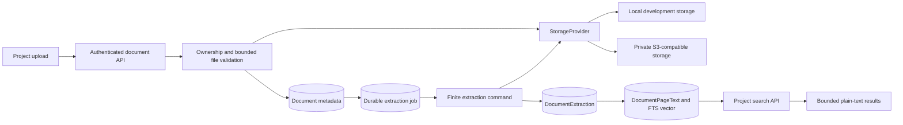
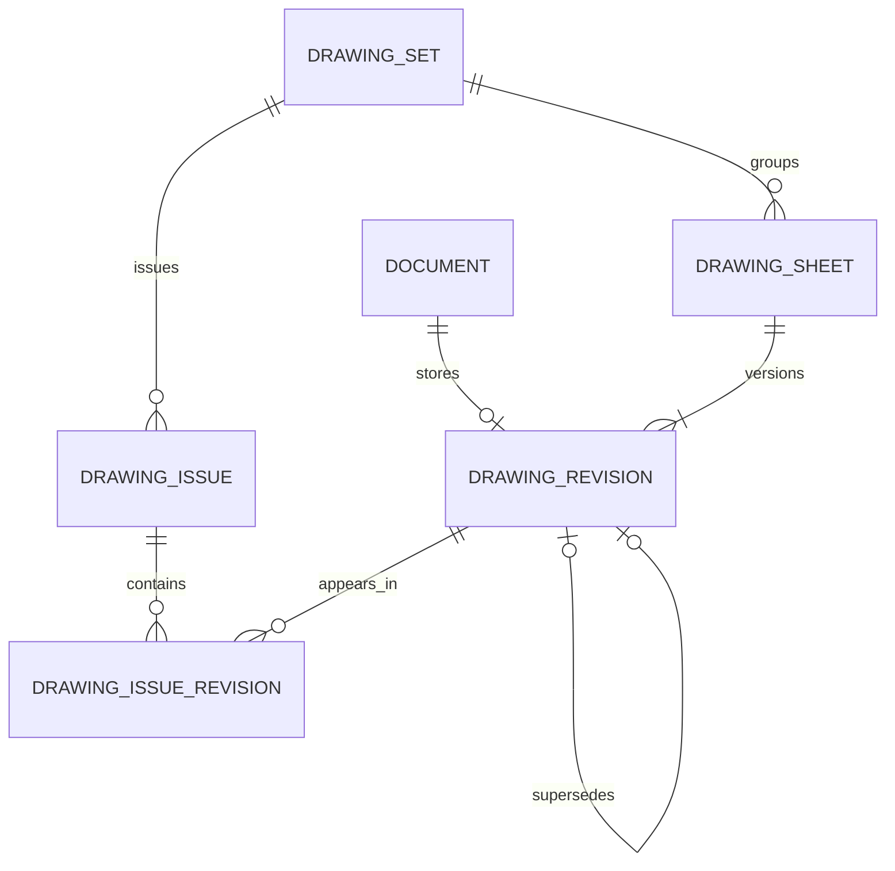
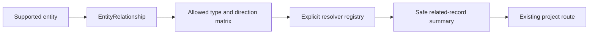
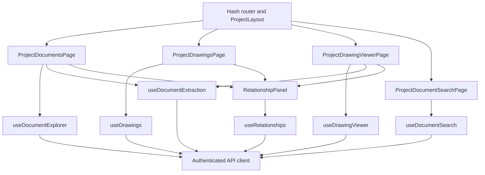

# M16 Document Management Platform

M16.1 through M16.7 deliver FieldFlow's project-owned document platform. This
page is the release-level map; focused storage, drawing, relationship, and
search contracts remain in the linked documents.

## Capability Status

| Area | Release status |
|---|---|
| Local, memory, and private S3-compatible storage providers | Shipped; memory is test-only |
| Project folders, explorer, metadata search, uploads, downloads, details, and soft deletion | Shipped |
| Drawing sets, sheets, revisions, issues, register, and secure PDF viewer | Shipped; drawings are PDF-only |
| Explicit relationships across ten allowlisted construction entity types | Shipped |
| Durable native PDF text extraction and PostgreSQL lexical search | Shipped |
| OCR provider boundary | Configured but disabled; production OCR is unavailable |
| Restore, permanent purge, general document version APIs, range delivery, and direct browser-to-S3 upload | Deferred |
| Semantic search, AI summaries, automatic relationships, drawing comparison, markups, measurements, antivirus, and Office/CAD extraction | Not supported |

## Milestone Inventory

| Phase | Shipped capability |
|---|---|
| M16.1 | Generic provider contract; local, memory, and S3-compatible implementations; `Document` and `Folder`; authenticated upload/download; SHA-256 checksums; soft deletion; version-ready metadata |
| M16.2 | Project Document Explorer; nested folders; breadcrumbs and tree; metadata search, filters, sorting, pagination, recent files, batch upload, details, download, and soft deletion |
| M16.3 | Drawing sets, sheets, revisions, superseding, drawing issues and membership, project register, and retained revision history |
| M16.4 | Authenticated PDF.js viewer with current and historical revisions, page/zoom/thumbnail controls, embedded-text search, metadata, and same-origin worker loading |
| M16.5 | Project-scoped `EntityRelationship`, resolver registry, allowed matrix, candidate search, and reusable record/drawing relationship UI |
| M16.6 | Checksum-bound durable extraction jobs, page text, PostgreSQL `simple` FTS, GIN indexing, extraction status/reprocess, and lazy project search |
| M16.7 | Release audit, verification record, architecture/API/model inventory, operational runbooks, manual QA guide, and deployment gate |

## End-to-End Architecture



Object storage and PostgreSQL do not share a transaction. Upload rollback
deletes an object when metadata persistence fails; if that cleanup fails, a
durable cleanup job retains the provider/key pair for a finite external
processor. Document deletion is a metadata soft delete and deliberately
retains the private object for a future retention/restore policy.





Formal drawing issue membership, revision superseding, document lineage,
folder hierarchy, and attachment parentage remain specialized models. The
generic relationship table adds context without replacing those invariants.



All four project document routes are lazy chunks. Project-keyed mounts,
`AbortController`, identity guards, and stale-response rejection clear prior
project data. Relationships and extraction details load only for the selected
record. Search does not run before explicit submit, and none of these features
adds a dashboard request.

The protected hashes are `#/projects/{project_id}/documents`,
`#/projects/{project_id}/drawings`, `#/projects/{project_id}/search`, and
`#/projects/{project_id}/drawings/sheets/{sheet_id}/revisions/{revision_id}/view`.
`ProjectLayout` exposes Documents, Drawings, and Document Search in project
navigation; exact revision results use the viewer deep link.

## API Inventory

Every route requires an authenticated current user. Project collection routes
use `get_owned_project`; direct IDs resolve through the owning project and do
not serialize storage keys, buckets, credentials, filesystem paths, provider
URLs, or internal exception text.

### Documents and Folders

| Method and route | Request and bounds | Response purpose |
|---|---|---|
| `POST /documents/upload` | Multipart `project_id`, optional `folder_id`, `display_name`, `document_type`, and one `file`; configured request/file limits | Persist safe metadata, store bytes once, calculate SHA-256, and queue extraction |
| `GET /documents/{document_id}` | Positive document ID | Full safe metadata for one owned, active document |
| `GET /documents/{document_id}/download` | Positive document ID | Authenticated bounded stream with safe disposition and sandbox headers |
| `DELETE /documents/{document_id}` | Positive document ID | Idempotent soft deletion; referenced drawing documents return conflict |
| `GET /projects/{project_id}/documents` | Optional `folder_id`; `limit` 1-500 and bounded `offset` | Compatibility document collection |
| `GET /projects/{project_id}/documents/explorer` | Folder; query <=200; exact type/MIME/extension filters; allowlisted sort/order; `limit` 1-100 | Immediate folders/documents, breadcrumbs, counts, extraction summaries, and pagination |
| `GET /projects/{project_id}/documents/recent` | `limit` 1-25 | Newest active current documents in active folders |
| `GET /projects/{project_id}/folders` | `limit` 1-500 and bounded `offset` | Flat owned folder collection |
| `GET /projects/{project_id}/folders/tree` | No body; server cap 500 and ancestry depth 32 | Safe flat tree source for the explorer |
| `POST /projects/{project_id}/folders` | JSON `name` and optional positive `parent_folder_id` | Create one validated sibling-unique folder |

### Drawings

| Method and route | Request and bounds | Response purpose |
|---|---|---|
| `GET, POST /projects/{project_id}/drawing-sets` | GET optional `include_archived`; POST strict set JSON | List or create project drawing sets |
| `GET, PATCH, DELETE /drawing-sets/{drawing_set_id}` | Positive ID; strict patch JSON | Read, edit, or archive a set |
| `GET, POST /drawing-sets/{drawing_set_id}/sheets` | POST multipart JSON metadata <=25,000 characters plus one validated PDF | List sheets or atomically create a sheet and first revision |
| `GET, PATCH, DELETE /drawing-sheets/{sheet_id}` | Positive ID; strict patch JSON | Read, edit, or archive a sheet |
| `GET /drawing-sheets/{sheet_id}/revisions` | `limit` 1-100 and bounded `offset` | Newest-first retained revision history |
| `GET /drawing-sheets/{sheet_id}/current-revision` | Positive sheet ID | Current revision selected by the sheet pointer |
| `POST /drawing-sheets/{sheet_id}/revisions` | Multipart JSON metadata <=25,000 characters plus one validated PDF | Atomically upload and supersede the prior current revision |
| `GET /drawing-revisions/{revision_id}/download` | Positive revision ID | Stream the exact owned current or historical PDF |
| `GET, POST /drawing-sets/{drawing_set_id}/issues` | POST strict issue JSON | List or create drawing issues |
| `GET, PATCH, DELETE /drawing-issues/{issue_id}` | Positive ID; strict patch JSON | Read/edit a draft or soft-delete a draft issue |
| `POST /drawing-issues/{issue_id}/revisions` | JSON `revision_id` | Add one same-set exact revision to a draft issue |
| `DELETE /drawing-issues/{issue_id}/revisions/{revision_id}` | Positive IDs | Remove membership while the issue is draft |
| `POST /drawing-issues/{issue_id}/issue` | No body | Freeze membership and issue idempotently |
| `POST /drawing-issues/{issue_id}/void` | No body | Retain and void an issued issue idempotently |
| `GET /projects/{project_id}/drawings` | Set/discipline/status filters; query <=200; allowlisted sort/order; `limit` 1-100 | Bounded drawing register with current revision summaries |

### Relationships

| Method and route | Request and bounds | Response purpose |
|---|---|---|
| `GET /projects/{project_id}/relationships` | Required entity type/ID; direction/type filters; `limit` 1-100 | Perspective-aware related records and pagination |
| `POST /projects/{project_id}/relationships` | Strict source type/ID, target type/ID, and relationship type | Validate matrix, project ownership, availability, direction, and duplicate rules |
| `DELETE /projects/{project_id}/relationships/{relationship_id}` | Positive relationship ID | Soft-delete only the relationship |
| `GET /projects/{project_id}/relationship-candidates` | Entity type; query <=200; `limit` 1-50; optional paired exclusion | Bounded safe metadata candidates with `has_more` |

### Extraction and Search

| Method and route | Request and bounds | Response purpose |
|---|---|---|
| `GET /projects/{project_id}/documents/{document_id}/extraction` | Positive project/document pair | Current safe extraction and active-job summary |
| `POST /projects/{project_id}/documents/{document_id}/extraction/reprocess` | Empty strict JSON object; per-user/project rate limit | Queue checksum-bound replacement processing and return `202` |
| `GET /projects/{project_id}/search` | Query 1-200; scope/type/set/discipline/current/method filters; `limit` 1-50 | Ranked page or metadata results, bounded snippets, safe route target, and pagination |

Shared important responses are `401` for authentication, `403` for an
unowned project collection, safe `404` for missing/foreign direct resources,
`409` for uniqueness or lifecycle conflicts, `413` for request/file limits,
`415` for unsupported file content, `422` for strict schema and bounds,
`429` for reprocess throttling, and safe `503` storage/extraction
unavailability. Transaction failures roll back and return controlled errors.

## Data Model Inventory

| Model | Ownership and lifecycle | Important database enforcement |
|---|---|---|
| `Document` | Required project/uploader; optional folder and lineage parent; soft deletion; current/version fields are foundation only | Project cascade, folder/parent `SET NULL`, unique opaque storage key, nonnegative size, positive version, project-listing and lineage indexes |
| `Folder` | Required project/creator; optional self parent; soft deletion | Project and parent cascade, unique project/path, partial active root/child sibling uniqueness, bounded ancestry in service |
| `DrawingSet` | Required project/creator; draft/active/archived; deletion archives | Status check, partial active project/name uniqueness, project listing index |
| `DrawingSheet` | Required project/set/creator; active/void/archived; deletion archives | Unique normalized number per set, set `RESTRICT`, project register index; current revision ID is application-managed to avoid a circular FK |
| `DrawingRevision` | Required project/sheet/document/uploader; immutable history with current/superseded state | Unique document, revision code and sequence per sheet; partial one-current index; document/sheet/successor `RESTRICT` |
| `DrawingIssue` | Required project/set/creator; draft/issued/void; draft deletion is soft | Status/purpose checks, unique issue number per set, retained listing index |
| `DrawingIssueRevision` | Exact issue-to-revision membership retained with history | Composite primary key; issue cascade and revision `RESTRICT`; one-revision-per-sheet rule is service-enforced |
| `EntityRelationship` | Required project/creator; soft deletion; parent IDs are allowlisted polymorphic references | Type/relationship/positive-ID/self checks, partial active-pair uniqueness, source/target/type indexes |
| `DocumentExtraction` | Exactly one current extraction state per Document | Document unique FK with cascade, controlled statuses/methods, nonnegative counts, project/status indexes |
| `DocumentPageText` | Page rows belong to one extraction and Document; replaced transactionally | Unique extraction/page, positive page/count checks, checksum-current join, PostgreSQL `tsvector` and GIN index |
| `DocumentExtractionJob` | Durable pending/processing/terminal work with attempts and lease token | Partial one-active-job per document/checksum, pending/lease/project indexes, positive attempts |

Project and user foreign keys enforce the stable ownership roots. Generic
relationship parent IDs cannot have native foreign keys to ten heterogeneous
tables; the resolver registry, allowed matrix, transaction checks, and safe
unavailable summaries provide application-level polymorphic integrity.

## Migration Chain

M16 is one linear chain after the M15 head:

```text
f8c2d6e0a315
  -> a6d3e9f1b742  document storage foundation
  -> b7e4f2a9c631  drawing management
  -> c8f1a4d7e290  drawing issue membership correction
  -> d9a2f5c8e173  entity relationships
  -> e4b7c2d9f651  extraction and search (head)
```

No historical migration was rewritten. Isolated tests cover fresh upgrade,
upgrade from the pre-M16 head with retained data, M16 downgrade/re-upgrade,
the drawing constraint correction, relationship partial uniqueness, and
extraction tables/indexes. Local PostgreSQL reports one head, current equals
`e4b7c2d9f651`, and Alembic autogenerate check reports no drift.

## Configuration and Operations

The provider-neutral storage layer intentionally retains the established
`ATTACHMENT_*` environment prefix because attachments and Documents share the
same production provider and validation policy. Renaming those public
deployment variables would break existing environments without adding a new
capability.

| Group | Variables and release behavior |
|---|---|
| Request/file limits | `MAX_REQUEST_BODY_BYTES`, `ATTACHMENT_MAX_UPLOAD_SIZE`, `ATTACHMENT_UPLOAD_CHUNK_SIZE`, optional `ATTACHMENT_PERMITTED_MIME_TYPES`; bounded safe defaults |
| Provider | `ATTACHMENT_STORAGE_PROVIDER`, `ATTACHMENT_LOCAL_STORAGE_ROOT`; local development defaults to an ignored backend directory, production requires S3 |
| S3-compatible | Bucket, endpoint, region, access key, secret, optional session token, addressing style, TLS requirement, connect/read timeouts, retries, and key prefix under `ATTACHMENT_S3_*` |
| Durable cleanup | Batch, attempts, backoff, lease, and retention under `ATTACHMENT_CLEANUP_*`; external recurring command remains required |
| Extraction | Enable switch, page/text limits, embedded-text threshold, timeout, attempts, retry, lease, batch, retention, and reprocess rate settings under `DOCUMENT_EXTRACTION_*` |
| OCR boundary | `DOCUMENT_OCR_ENABLED=false`, `DOCUMENT_OCR_PROVIDER=disabled`, plus language/render bounds; startup rejects a false production-enabled claim |
| Search | PostgreSQL is required; the text-search configuration is fixed to `simple` and is not environment-configurable |

The complete M16 variable inventory is:

```text
MAX_REQUEST_BODY_BYTES
ATTACHMENT_STORAGE_PROVIDER, ATTACHMENT_LOCAL_STORAGE_ROOT
ATTACHMENT_MAX_UPLOAD_SIZE, ATTACHMENT_UPLOAD_CHUNK_SIZE
ATTACHMENT_PERMITTED_MIME_TYPES
ATTACHMENT_S3_BUCKET, ATTACHMENT_S3_REGION, ATTACHMENT_S3_ENDPOINT_URL
ATTACHMENT_S3_ACCESS_KEY_ID, ATTACHMENT_S3_SECRET_ACCESS_KEY
ATTACHMENT_S3_SESSION_TOKEN, ATTACHMENT_S3_ADDRESSING_STYLE
ATTACHMENT_S3_SECURE_TRANSPORT, ATTACHMENT_S3_CONNECT_TIMEOUT
ATTACHMENT_S3_READ_TIMEOUT, ATTACHMENT_S3_MAX_RETRIES
ATTACHMENT_S3_KEY_PREFIX
ATTACHMENT_CLEANUP_BATCH_SIZE, ATTACHMENT_CLEANUP_MAX_ATTEMPTS
ATTACHMENT_CLEANUP_RETRY_BASE_SECONDS, ATTACHMENT_CLEANUP_RETRY_MAX_SECONDS
ATTACHMENT_CLEANUP_LEASE_SECONDS, ATTACHMENT_CLEANUP_RETENTION_DAYS
DOCUMENT_EXTRACTION_ENABLED, DOCUMENT_EXTRACTION_MAX_PAGES
DOCUMENT_EXTRACTION_MAX_CHARS_PER_PAGE
DOCUMENT_EXTRACTION_MAX_CHARS_PER_DOCUMENT
DOCUMENT_EXTRACTION_EMBEDDED_TEXT_THRESHOLD
DOCUMENT_EXTRACTION_TIMEOUT_SECONDS, DOCUMENT_EXTRACTION_MAX_ATTEMPTS
DOCUMENT_EXTRACTION_RETRY_BASE_SECONDS
DOCUMENT_EXTRACTION_RETRY_MAX_SECONDS, DOCUMENT_EXTRACTION_LEASE_SECONDS
DOCUMENT_EXTRACTION_BATCH_SIZE, DOCUMENT_EXTRACTION_RETENTION_DAYS
DOCUMENT_EXTRACTION_REPROCESS_RATE_LIMIT
DOCUMENT_EXTRACTION_REPROCESS_RATE_WINDOW_SECONDS
DOCUMENT_OCR_ENABLED, DOCUMENT_OCR_PROVIDER, DOCUMENT_OCR_LANGUAGE
DOCUMENT_OCR_MAX_PAGES, DOCUMENT_OCR_DPI, DOCUMENT_OCR_MAX_PIXELS
DOCUMENT_OCR_MAX_DIMENSION, DOCUMENT_OCR_PAGE_TIMEOUT_SECONDS
```

`backend/.env.example` supplies safe local defaults and placeholders. Render
stores database/provider credentials as secret values, selects private S3,
uses HTTPS-only origin/cookie settings, and leaves OCR disabled. Provider
construction rejects missing S3 fields, unsafe endpoints/prefixes, an HTTP
endpoint when secure transport is enabled, and invalid addressing values;
bounded environment parsing and application startup reject inconsistent
request/file, retry/timeout, OCR, and production security settings.

Render runs migrations before the API and invokes the finite extraction
command every ten minutes with a 25-job ceiling. The cron must receive the
same database and object-storage configuration as the API. Attachment cleanup
is a separate finite command and still requires an external recurring
schedule. Operators must choose cron timeouts, batch size, and lease values
that leave headroom for the configured per-document timeout and must monitor
pending, retryable, failed, and expired-lease counts.

See [Document Operations](DOCUMENT_OPERATIONS.md) for command and recovery
steps and [M16 Manual QA](DOCUMENT_QA.md) for the live release matrix.

## Security and Authorization

- M15 memory-only access tokens, rotating refresh sessions, CSRF, exact CORS,
  security headers, request limits, rate limits, strict mutation schemas,
  bounded IDs, transaction rollback, and log redaction remain unchanged.
- Ownership is always inherited from the project. Nested set/sheet/revision,
  folder, document, relationship, and search pairs are validated in the same
  project before data or bytes are returned.
- Filenames are NFKC-normalized and reject traversal, separators, control
  characters, reserved names, trailing dots/spaces, missing/long extensions,
  and overlong values. MIME, extension, and signature must agree.
- Viewer bytes use authenticated Blob requests. The PDF.js worker is
  same-origin; eval and XFA are disabled; links, forms, annotations, embedded
  files, launch actions, and PDF JavaScript are not rendered.
- Extracted text and snippets remain plain text. API responses never return a
  full extracted page, unsafe HTML, provider metadata, or parser traces.

## Performance Boundaries

| Surface | Request/query boundary |
|---|---|
| Explorer | One explorer, one folder-tree, and one recent request for initial state; no request per row; document page <=100 and tree <=500 |
| Drawings | One sets request and one bounded register request initially; sheets, issues, history, and relationships load for selected context only |
| Viewer | One authenticated PDF request per revision session; no page network requests; at most 31 page controls and five eligible thumbnail canvases |
| Relationships | One selected-entity list request; candidate search is dialog-only and batched by entity type; no dashboard or table-row fan-out |
| Search | One request per explicit submit/page/filter action; PostgreSQL performs bounded count/result work; no binary fetch or PDF worker |
| Extraction | Finite bounded claims, PostgreSQL `SKIP LOCKED`, one lease token per claim, checksum guard, and terminal-job pruning |

## Release Verification

Verification on August 1, 2026 produced:

| Gate | Result |
|---|---|
| Focused M16 backend | Pass: 84 tests and 75 subtests |
| Complete backend | Pass: 287 tests and 317 subtests in 163.22 seconds |
| Focused M16 frontend | Pass: 168 tests across 20 files |
| Complete frontend | Pass: 433 tests across 62 files in 31.17 seconds |
| Combined primary total | 720 |
| ESLint / production build | Pass / Pass, 137 modules transformed |
| `pip check` / Python audit | Pass / Not available (`pip-audit` is not installed) |
| npm production / full audit | 0 vulnerabilities / 2 pre-existing high-severity development-tool advisories |
| Alembic | Current=head=`e4b7c2d9f651`; one head; check clean; isolated lifecycle pass |
| PostgreSQL FTS | GIN index exists; local 100,000-row probe used a Bitmap Index Scan; real service smoke returned one project-scoped page result |
| Finite commands | Extraction and attachment-cleanup zero-job smokes pass |
| Local/S3 storage | Local and deterministic provider suites pass; live S3 Not Verified because credentials are not configured |
| Live browser matrix | Not Verified; no repository browser automation harness or controlled authenticated test session was available |
| Production probe | Frontend returned 200 with configured security headers; API returned no bytes within a bounded 30-second probe |

The passing automated and repository gates support **Ready to merge**. The
milestone is **Not production verified** until deployment, private object
storage, API health, worker/cleanup schedules, authenticated browser flows,
cookie/CORS behavior, live search/extraction, responsive viewports, and the
browser matrix are exercised in the target environment.

### Final Bundles

| Chunk | Raw | Gzip |
|---|---:|---:|
| Main | 278.29 kB | 85.15 kB |
| CSS | 74.45 kB | 13.53 kB |
| Project Documents | 26.92 kB | 7.60 kB |
| Drawings | 34.51 kB | 8.39 kB |
| Drawing Viewer | 450.07 kB | 133.87 kB |
| PDF worker | 1,262.39 kB | 374.85 kB |
| Relationships | 17.97 kB | 5.45 kB |
| Document Search | 9.91 kB | 2.84 kB |
| Dashboard | 21.07 kB | 5.23 kB |

M16.7 changes no application chunk, so these match M16.6. Focused phase
documents retain the M16.4-M16.6 deltas; the viewer, relationship system, and
search remain isolated behind lazy route/component chunks.

### Dependency Review

- Frontend uses exactly one PDF rendering library: `pdfjs-dist` `6.2.108`,
  pinned exactly in `package.json` and Apache-2.0 licensed.
- Backend uses `pypdfium2` `5.12.1`, pinned exactly in `requirements.txt`; its
  installed metadata declares BSD-3-Clause, Apache-2.0, and bundled dependency
  licenses.
- No OCR runtime dependency is installed or implied. The disabled provider and
  deterministic test providers preserve that boundary.
- M16 does not introduce a second PDF library for the same runtime role:
  PDF.js renders in the browser, while PDFium extracts bounded text in the
  finite backend command.
- No broad unrelated package upgrade is part of M16.7.

## Known Limits and Release Risks

- Live S3, authenticated browsers, target cookie/CORS behavior, deployed
  extraction/search, and production cron execution remain Not Verified.
- The deployed API did not answer the bounded closeout probe; production stays
  gated until health and authenticated M16 workflows pass.
- Attachment cleanup requires a separately configured schedule. Extraction
  cron batch, max-job, timeout, and lease settings require operational
  monitoring so a claimed batch cannot outlive its lease assumptions.
- Production OCR, hard parser process isolation, antivirus, restore, and purge
  do not exist. Cooperative parser limits reduce impact but are not an OS
  sandbox.
- Generic relationship IDs trade native parent foreign keys for an explicit
  allowlist/resolver integrity boundary.
- The viewer downloads a complete PDF and the worker is the largest lazy
  asset; range delivery and production long-PDF/browser measurements are
  deferred.
- The full npm development tree has two high advisories in build tooling. The
  production tree is clean; Python advisory status is unknown because
  `pip-audit` is not installed.
- Vitest completes successfully but jsdom emits its known navigation warning
  when a test exercises browser download navigation.

## Focused References

- [Document Storage](DOCUMENT_STORAGE.md)
- [Drawing Management](DRAWING_MANAGEMENT.md)
- [Document Relationships](DOCUMENT_RELATIONSHIPS.md)
- [Document Extraction and Search](DOCUMENT_SEARCH.md)
- [Document Operations](DOCUMENT_OPERATIONS.md)
- [M16 Manual QA](DOCUMENT_QA.md)
- [Security and Production Readiness](SECURITY.md)
- [Screenshot Checklist](screenshots/README.md)
