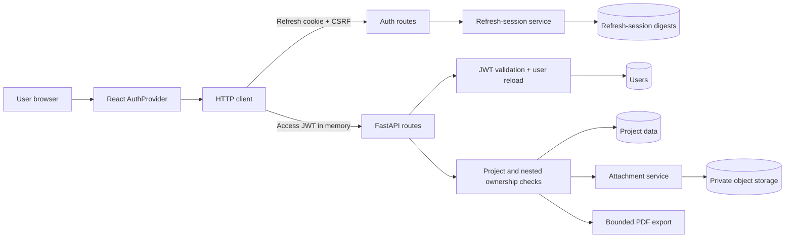

# FieldFlow Security and Production Readiness

This document is the operational security reference for FieldFlow. It
describes the implementation delivered in M15.1-M15.5, the controls required
for deployment, and the verification needed before a release is approved.

The repository is security-regression ready. The hosted environment must still
deploy the M15.5 commit and pass the production checklist before it is treated
as release-ready.

## Security Architecture

FieldFlow uses a React SPA on Vercel and a FastAPI API on Render. These
origins are cross-origin and cross-site. The browser sends short-lived access
tokens in `Authorization` headers and sends refresh and CSRF cookies only to
the API's `/auth` path.



### Authentication

- Registration normalizes the complete email address, validates password
  length in UTF-8 bytes, hashes the password with bcrypt, and returns a generic
  conflict response for an existing identity.
- Login applies a bounded email-and-client-address rate limit. Unknown users
  receive the same response and password-verification work as wrong passwords.
- A successful login creates a new refresh-session family and a short-lived
  HS256 access JWT. The access token is returned to the SPA and held only in
  module memory.
- The opaque refresh token is stored in an HttpOnly API cookie. PostgreSQL
  stores only a keyed HMAC-SHA256 digest.
- Startup restoration obtains a CSRF token and rotates the refresh token. A
  normal 401 means signed out; a network failure or timeout produces a retry
  state instead of an expiration notice.
- Every refresh consumes the current session under a row lock, creates a
  replacement in the same family, and rotates both refresh and CSRF cookies.
- Reuse of a revoked refresh token revokes all active sessions in that family.
- Logout revokes the presented family and clears both cookies. The SPA clears
  local authentication first, so an unavailable API cannot leave private UI
  active.
- Every protected request validates the JWT signature, issuer, audience,
  expiry, issue time, type, token ID, subject, and user ID, then reloads the
  user. Deleted users are rejected with the same generic 401.

### Authorization

- `get_owned_project` loads a project with both project ID and current user ID.
- Project-scoped routers depend on that owned project before listing or
  mutating nested records.
- Update and delete queries verify that the nested record belongs to the
  requested project.
- Related task, predecessor, template, attachment-parent, and workflow
  references are validated within the same project boundary.
- Template lists are filtered by user; applying a template requires both an
  owned project and a template owned by the same user.
- Attachment list, upload, download, and delete operations resolve the
  allowlisted parent type under the owned project. Client input never supplies
  storage keys.
- PDF export depends on the owned project and reads only that project's tasks.
- Missing and foreign nested resources use the established safe 403/404
  policy and do not mutate data.

### Request and Transaction Security

- Pydantic mutation models reject unknown fields, strip surrounding
  whitespace, bound strings and numbers, and validate business date ordering.
- Positive IDs and collection pagination are bounded before route logic.
- ASGI middleware enforces the request-body ceiling before multipart parsing
  and while streamed chunks are received.
- Security headers and `Cache-Control: no-store` are added to API responses.
- CORS permits credentials only for exact configured origins.
- Refresh and logout require a trusted `Origin`, CSRF cookie, and matching
  `X-CSRF-Token` header.
- Task reorder, template application, session rotation, attachment metadata,
  durable cleanup, and other multi-step mutations use explicit transaction
  boundaries.
- Opportunistic refresh-session cleanup is bounded and isolated in a
  savepoint, so cleanup failure does not invalidate a successful login or
  refresh transaction.
- Authentication logs use fixed event names and exclude credentials, tokens,
  cookies, headers, request bodies, token digests, and secret configuration.

## Threat Model

### Assets

- User credentials and authenticated sessions
- Project schedules, field records, financial change-order data, and exports
- Attachment metadata and private object content
- Tenant ownership boundaries
- Database and object-storage credentials
- Application signing and refresh-digest secrets
- Service availability and audit-relevant security events

### Attackers

- An unauthenticated internet client
- An authenticated user attempting horizontal tenant access
- An attacker with script execution in the frontend origin
- An attacker with a stolen access token or refresh cookie
- A malicious uploader or user supplying hostile record text
- An automated brute-force or resource-exhaustion client
- An operator or deployment error that weakens production configuration

### Trust Boundaries

- Browser to Vercel static hosting
- Browser to the cross-site Render API
- Render edge to the FastAPI process
- FastAPI to PostgreSQL
- FastAPI to private object storage
- Deployment control plane to application secrets

### Threats and Controls

| Threat | Mitigation and reason | Residual risk |
|---|---|---|
| Stolen access token | Short expiry, strict claims, bearer use only, memory-only frontend storage, and user reload limit persistence and reject deleted users. | A token remains usable until expiry; no access-token denylist exists. |
| Stolen refresh cookie | HttpOnly, Secure production cookie; restricted path; CSRF and Origin validation; rotation and family replay revocation. | Malware, browser compromise, or a same-origin server compromise can still use the session. |
| XSS | No access token persistence, React escaping, safe PDF escaping, sandboxed attachment responses, and restrictive hosting headers reduce impact. | FieldFlow does not yet ship a rigorously tested Content Security Policy. |
| CSRF | Double-submit CSRF token plus exact Origin checks on refresh and logout. | A full frontend-origin compromise bypasses browser CSRF controls. |
| Refresh replay | One-time rotation, row locking, digest lookup, and family revocation on reuse. | Concurrent tabs without Web Locks may race and revoke a legitimate family. |
| Session fixation | Refresh tokens are server-generated random values and replaced at login and refresh. | Existing stolen families are not globally revoked by a new login. |
| Brute force | Uniform login response, dummy bcrypt work, normalized identities, bounded login/register limits, and `Retry-After`. | The limiter is per-process, resets on restart, and is not globally distributed. |
| Account enumeration | Login and duplicate-registration responses avoid confirming identity existence. | Timing differences are reduced, not proven impossible. |
| Tenant escape | Database-backed current user, owned-project dependency, scoped nested queries, template ownership, and attachment/export ownership tests. | A future route can regress if it bypasses established dependencies. |
| Malicious upload | Parent allowlist, ownership checks, extension/MIME/signature validation, opaque keys, size limits, private storage, and sandboxed delivery. | No antivirus or content-disarm service is implemented. |
| Malicious PDF text | ReportLab text is escaped, external resources are not loaded, task counts are bounded, filenames are safe, and temporary files are cleaned. | PDF readers remain external software with their own risk. |
| Oversized request | ASGI request ceiling, streamed byte counting, per-file limits, list bounds, and export task limits. | The deployment proxy must enforce an equal or stricter ceiling. |
| Malformed input | Strict schemas, unknown-field rejection, enum/date/numeric validation, bounded IDs, and generic errors. | Product-specific validation must be added with each new field. |
| Concurrent refresh | Same-tab single-flight, one retry, browser Web Lock when available, row lock, and family replay handling. | The fallback cannot guarantee cross-tab serialization. |
| Browser storage compromise | Tokens are absent from localStorage, sessionStorage, IndexedDB, and URLs; legacy keys are removed. | XSS can read the current in-memory access token while active. |
| Deployment misconfiguration | Production startup rejects weak secrets, debug, insecure cookies, missing origins, wildcard origins, and excessive limits. | CDN, proxy, DNS, and secret-manager settings remain operational responsibilities. |

## Security Design Decisions

| Decision | Why it is used | Rejected alternative or tradeoff |
|---|---|---|
| Memory-only access token | Limits persistence after XSS, device sharing, and browser restart. | localStorage and sessionStorage were rejected because JavaScript-readable persistence increases theft duration. |
| Opaque refresh token | A random value exposes no identity or claims and supports server-side revocation. | A long-lived refresh JWT would make replay and immediate family revocation harder. |
| Keyed HMAC digest storage | A database leak does not directly reveal usable refresh tokens; a server-held key prevents useful offline token guessing. | Raw token storage was rejected. Plain SHA-256 was unnecessary because a dedicated secret is available. |
| Rotation and family revocation | A refresh token is single-use and reuse becomes a detectable security event. | Reusable long-lived cookies cannot reliably detect replay. |
| Double-submit CSRF plus Origin | The CSRF cookie is readable by the SPA while the refresh cookie remains HttpOnly; exact Origin adds a second browser boundary. | CORS alone does not prevent forged state-changing requests. |
| Exact credentialed CORS | The known production and local origins are explicit and testable. | Wildcards and `*.vercel.app` suffix trust were rejected. |
| Secure, SameSite=None production cookies | Required by the current Vercel-to-Render cross-site topology. | Lax would not support credentialed cross-site refresh. Cookie prefixes were deferred because local HTTP and `/auth` path restrictions conflict with a single portable name. |
| Database-backed current user | Deleted users stop authorizing immediately and JWT identity claims are checked against canonical data. | Trusting claims alone would leave deleted accounts active until token expiry. |
| Ownership in queries | Tenant scope is enforced before serialization or mutation. | Fetch-then-authorize patterns are easier to omit and can reveal record existence. |
| One retry after 401 | Recovers from an expired access token without loops or repeated mutations. | Unlimited retries can create storms and duplicate writes. |
| Single-flight refresh | Concurrent same-tab failures share one refresh and release one queue. | Independent refreshes would consume the same token and trigger replay handling. |
| BroadcastChannel with storage fallback | Propagates logout, expiration, and restoration without broadcasting tokens. | Persisting session material or assuming BroadcastChannel availability was rejected. |
| Web Locks where available | Serializes cross-tab refresh around the shared cookie. | A custom distributed browser lock would add fragile storage and expiry logic. |
| Bounded in-memory rate limit | Adds immediate abuse resistance without infrastructure expansion. | Redis was deferred until multiple API instances or global enforcement justify it. |
| Savepoint cleanup | Old-session cleanup is useful but must not break a valid authentication transaction. | A background worker is not currently deployed; unbounded inline cleanup would add latency and failure coupling. |

## Deployment Guide

### Production Topology

- Frontend: `https://construction-scheduler-eight.vercel.app`
- API: `https://construction-scheduler-api.onrender.com`
- Database: managed PostgreSQL
- Attachments: private S3-compatible object storage
- Topology: HTTPS, cross-origin, and cross-site
- Preview policy: Vercel previews do not receive credentialed production API
  access unless their exact origin is deliberately configured.

Use matching hostnames for local frontend and API URLs when testing cookies.
For example, use `127.0.0.1` for both origins or `localhost` for both.

### Environment Variables

Use `backend/.env.example` and `frontend/.env.example` as the canonical
inventory. Never copy production values into repository files.

| Variable group | Requirement |
|---|---|
| `DATABASE_URL` | Required secret; PostgreSQL connection owned by Render. |
| `SECRET_KEY` | Required secret; 32+ random non-placeholder characters. |
| `REFRESH_TOKEN_SECRET` | Independent production secret; 32+ random characters. Rotation invalidates existing refresh cookies. |
| `APP_ENV`, `APP_DEBUG` | Production requires `production` and `false`. |
| `ALLOWED_ORIGINS` | Exact comma-separated HTTPS origins; no wildcard, path, query, credentials, or suffix matching. |
| `JWT_ISSUER`, `JWT_AUDIENCE` | Nonblank stable identifiers shared by token issue and validation. |
| Access/refresh lifetimes | Positive and bounded; current production values are 15 minutes and 14 days. |
| Cookie names/path | Valid cookie names; path remains `/auth`; no Domain is needed. |
| `COOKIE_SECURE`, `COOKIE_SAMESITE` | Production requires `true` and `none` for the current cross-site topology. |
| Request and rate limits | Keep the request ceiling above the file limit plus multipart overhead and within configured maxima. |
| Refresh cleanup | Keep batch and retention values bounded; current defaults are 100 rows and 30 days. |
| Attachment variables | Production uses `s3`, a private bucket, least-privilege credentials, secure transport, bounded retries, and durable cleanup settings. |
| `VITE_API_URL` | Public build-time value set to the HTTPS Render API. |
| `VITE_AUTH_REQUEST_TIMEOUT_MS` | Public build-time integer from 1,000 to 60,000; default 10,000. |

### Deploy and Migrate

1. Back up PostgreSQL and record the currently deployed application commit.
2. Confirm Render secret values and private object-storage access.
3. Run the full verification commands in this document.
4. Deploy the Render service. Its start command runs:

   ```bash
   alembic upgrade head
   uvicorn app.main:app --host 0.0.0.0 --port $PORT
   ```

5. Confirm the Render health check returns exactly `{"status":"online"}`.
6. Deploy Vercel with `VITE_API_URL` set to the production API.
7. Confirm Vercel serves the committed headers from `frontend/vercel.json`.
8. Run the post-deployment browser and API checks before announcing release.

Database migrations run before the new API process starts. Do not run
concurrent deploys against different migration heads.

### HTTPS and Proxy Requirements

- Vercel and Render must redirect HTTP to HTTPS.
- HSTS is expected at the hosting edge; do not add application HSTS until
  trusted-proxy and HTTPS behavior are verified.
- Preserve the original client address only through the platform's trusted
  proxy configuration. The application intentionally ignores arbitrary raw
  forwarding headers.
- Configure the edge request limit at or below the application
  `MAX_REQUEST_BODY_BYTES` value.

### Restart Order

For a normal deploy: database availability, object storage, Render migration
and API, cleanup scheduler, then Vercel. For recovery, restore dependencies
before API traffic and verify the API before restoring the frontend release.

### Rollback

1. Stop further deploys and preserve logs, timestamps, and the failing commit.
2. If the schema is backward compatible, redeploy the previous API commit.
3. Roll back Vercel to its prior deployment after the compatible API is
   healthy.
4. Do not downgrade PostgreSQL unless the specific Alembic downgrade was
   tested against a backup and no newer data would be lost.
5. Restore object-storage credentials or provider routing independently when
   the database remains correct.
6. Re-run health, login, refresh, ownership, upload, and export smoke tests.

## Production Checklist

### Infrastructure and Database

- [ ] The approved commit is deployed to both Render and Vercel.
- [ ] PostgreSQL backup and restore procedures have been tested.
- [ ] `python -m alembic heads` reports one head.
- [ ] `python -m alembic current` equals the repository head.
- [ ] `python -m alembic check` reports no pending operations.
- [ ] The database user has only required schema and data privileges.
- [ ] The private object-storage bucket denies public access.
- [ ] Attachment cleanup runs on a bounded external schedule.

### Secrets and Environment

- [ ] `APP_ENV=production` and `APP_DEBUG=false`.
- [ ] `DATABASE_URL`, `SECRET_KEY`, and `REFRESH_TOKEN_SECRET` are secret-managed.
- [ ] Signing and refresh secrets are independent and meet length rules.
- [ ] No example, placeholder, or development secret is deployed.
- [ ] `VITE_API_URL` points to the HTTPS production API.
- [ ] Preview deployments cannot use production sessions by wildcard.

### Cookies, CORS, and CSRF

- [ ] Refresh cookie is HttpOnly, Secure, SameSite=None, and Path=/auth.
- [ ] CSRF cookie is readable, Secure, SameSite=None, and Path=/auth.
- [ ] Neither cookie has an unnecessary Domain attribute.
- [ ] Logout, invalid session, and replay responses clear both cookies.
- [ ] The exact Vercel origin is the only production allowed origin.
- [ ] Credentialed preflight permits Authorization and X-CSRF-Token.
- [ ] Missing or mismatched CSRF and untrusted Origin return safe 403 responses.

### Headers, HTTPS, and Caching

- [ ] Frontend and API redirect HTTP to HTTPS.
- [ ] HSTS is visible from the production delivery path.
- [ ] Frontend and API send `X-Content-Type-Options: nosniff`.
- [ ] Frontend and API deny framing and set referrer and permissions policies.
- [ ] Sensitive API responses use `Cache-Control: no-store`.
- [ ] Attachment responses have safe type, disposition, CSP, and CORP headers.

### Authentication and Authorization

- [ ] Registration, login, startup restoration, refresh, and logout pass.
- [ ] Expired access token causes one refresh and one retry.
- [ ] Refresh rotation replaces both cookies.
- [ ] Replayed refresh token revokes its family.
- [ ] Deleted-user access and refresh are rejected.
- [ ] Two users cannot access each other's projects, templates, records, attachments, or exports.
- [ ] Rate limits return 429 and `Retry-After`.

### Uploads, Exports, and Validation

- [ ] Valid synthetic files upload, download, preview, and delete.
- [ ] Unsupported, mismatched, foreign-parent, and oversized uploads fail safely.
- [ ] Storage failures leave durable cleanup work without exposing keys.
- [ ] Owned PDF export succeeds with safe filename and headers.
- [ ] Hostile ReportLab text remains inert.
- [ ] Foreign and excessive exports fail without leaked data or paths.
- [ ] Unknown fields, malformed IDs, invalid dates, and excessive lists fail safely.

### Operations and Accessibility

- [ ] Authentication, replay, 429, 413, 5xx, storage, and export alerts are configured.
- [ ] Logs exclude credentials, tokens, cookies, headers, bodies, and secret values.
- [ ] Health is public, minimal, fast, and monitored.
- [ ] Login, retry, expiration, and logout work by keyboard with visible focus.
- [ ] Auth views pass 320, 375, 768, 1024, desktop, and 200% zoom checks.
- [ ] Chromium, Firefox, Safari/WebKit, and Edge smoke tests are recorded.
- [ ] Incident contacts, secret rotation owners, and rollback authority are assigned.

### Current Deployment Gate

Verification on July 29, 2026 found:

- Vercel returned 200 and HSTS, but did not yet serve the M15.5 security
  headers.
- The Render API returned no response bytes within a finite 60-second probe.

Do not approve the production release until the M15.5 commit is deployed and
every applicable item above passes.

### Repository Verification Record

Verification completed on July 29, 2026:

| Check | Result |
|---|---|
| Backend tests | Pass: 213 tests and 251 subtests |
| Frontend tests | Pass: 291 tests across 43 files |
| ESLint | Pass |
| Production build | Pass: 100 modules transformed |
| Main bundle | 268.23 kB raw / 83.02 kB gzip |
| CSS bundle | 41.21 kB raw / 8.61 kB gzip |
| `pip check` | Pass: no broken requirements |
| Alembic head/current | `f8c2d6e0a315` / `f8c2d6e0a315` |
| Alembic check | Pass: no new upgrade operations |

## Operational Runbooks

### Refresh Token Replay

**Symptoms:** `refresh_token_reuse` warning, refresh 401s, or a user reports
being signed out across tabs. **Likely causes:** duplicated stale cookie,
cross-tab race without Web Locks, or stolen token. **Immediate response:**
preserve event time and user context without logging tokens; treat repeated
events as possible compromise. **Recovery:** have the user log in to create a
new family; rotate the refresh secret only for systemic compromise.
**Verification:** old family remains revoked and the new session rotates once.

### Lost JWT Secret

**Symptoms:** signing secret is exposed or cannot be trusted. **Likely causes:**
secret-manager disclosure, operator error, or repository leakage. **Immediate
response:** restrict access, preserve evidence, and generate a new independent
secret. **Recovery:** update `SECRET_KEY` and restart all API instances;
existing access JWTs become invalid. **Verification:** old access tokens return
401 and new login tokens succeed.

### Lost Refresh Secret

**Symptoms:** refresh-digest key is exposed. **Likely causes:** secret-manager
or host compromise. **Immediate response:** generate a new
`REFRESH_TOKEN_SECRET` and communicate a forced sign-in. **Recovery:** deploy
the new secret; existing cookie digests no longer match. Optionally remove old
session rows after evidence is retained. **Verification:** old refreshes fail
and new login/rotation succeeds.

### Database Unavailable

**Symptoms:** login, refresh, and protected requests return 5xx or time out.
**Likely causes:** provider outage, connection exhaustion, DNS, credentials,
or migration failure. **Immediate response:** stop migrations and repeated
restarts; check provider health and connection limits. **Recovery:** restore
database connectivity, then restart the API. **Verification:** health, login,
refresh, ownership lookup, and one write transaction succeed.

### Rate-Limit Spike

**Symptoms:** elevated 429s or authentication rejection logs. **Likely causes:**
credential stuffing, client retry loops, shared proxy identity, or a campaign.
**Immediate response:** inspect aggregate identity/IP patterns without logging
credentials. **Recovery:** block abusive sources at the edge and correct
clients; do not arbitrarily raise limits. **Verification:** legitimate login
works after the window and abusive traffic remains controlled.

### Storage Outage

**Symptoms:** upload/download 503s or growing attachment cleanup retries.
**Likely causes:** provider outage, expired credentials, bucket policy, DNS,
or region mismatch. **Immediate response:** preserve database metadata and
cleanup jobs; do not delete keys manually. **Recovery:** restore credentials
or provider availability and run bounded cleanup. **Verification:** synthetic
upload/download/delete succeeds and pending jobs drain idempotently.

### PDF Failures

**Symptoms:** owned exports return a safe server error. **Likely causes:** bad
data edge case, ReportLab failure, resource ceiling, or temporary storage.
**Immediate response:** record project ID and event time, never field contents
or generated paths. **Recovery:** reproduce with synthetic data and restore
the previous compatible build if widespread. **Verification:** hostile,
Unicode, long-field, and task-limit exports pass with no temporary files.

### Large Upload Failures

**Symptoms:** expected 413, unexpected connection reset, or proxy/application
limit mismatch. **Likely causes:** file over 25 MiB, multipart overhead, CDN
limit, false Content-Length, or client retry. **Immediate response:** compare
edge, request-body, and per-file limits. **Recovery:** correct mismatched
configuration; do not increase limits without product approval.
**Verification:** just-under succeeds, just-over returns safe 413, and no
temporary file remains.

### Deployment Rollback

**Symptoms:** health, auth, migration, or core smoke checks fail after deploy.
**Likely causes:** incompatible code/schema, missing environment, or hosting
configuration. **Immediate response:** freeze deploys and record both commits.
**Recovery:** follow the rollback procedure above; prefer application rollback
over an untested database downgrade. **Verification:** previous health and
smoke-test baseline is restored.

### Emergency Logout of Every User

**Symptoms:** systemic session compromise or mandatory global revocation.
**Likely causes:** refresh-secret or authentication-host compromise.
**Immediate response:** rotate `REFRESH_TOKEN_SECRET`; rotate `SECRET_KEY` too
if access tokens are affected. **Recovery:** restart all API instances and
require login. **Verification:** old access and refresh material fails while
new sessions work. There is no user-facing global-logout command.

### Compromised Account

**Symptoms:** unauthorized project activity or repeated replay events.
**Likely causes:** stolen credentials, browser compromise, or shared account.
**Immediate response:** preserve logs, delete or otherwise disable the user
through controlled database operations, and protect project data.
**Recovery:** because password reset is not implemented, restore access only
through an approved operator process. **Verification:** deleted-user access
and refresh return generic 401 and other tenants remain unaffected.

### Deleted User

**Symptoms:** the user receives 401 on protected access and refresh.
**Likely causes:** intentional deletion or incorrect administrative data
operation. **Immediate response:** confirm the deletion audit trail.
**Recovery:** recreate access only through an approved identity process; do
not edit token claims or refresh rows. **Verification:** old JWT and refresh
family stay invalid and a newly registered identity owns no old projects.

### Cookie Issues

**Symptoms:** login succeeds but restoration/logout fails, cookies do not
appear, or deletion is ineffective. **Likely causes:** Secure/SameSite/path
mismatch, wrong API URL, clock problems, or stale deployment. **Immediate
response:** inspect Set-Cookie attributes without recording values.
**Recovery:** align environment values and redeploy API and frontend.
**Verification:** both cookies use `/auth`, rotate, and clear in the supported
browser.

### Cross-Site Cookie Failures

**Symptoms:** production refresh omits cookies despite successful login.
**Likely causes:** third-party cookie restrictions, privacy mode, or missing
`SameSite=None; Secure`. **Immediate response:** reproduce in the affected
browser and inspect cookie blocking reasons. **Recovery:** correct flags; for
policy-based blocking, use a same-site custom API domain in a future release.
**Verification:** refresh works after reload in each supported browser.

### Origin Mismatch

**Symptoms:** failed preflight or safe 403 from refresh/logout. **Likely
causes:** unlisted frontend, scheme/port mismatch, preview deployment, or
trailing configuration error. **Immediate response:** compare the exact
browser Origin with `ALLOWED_ORIGINS`. **Recovery:** add only an explicitly
approved exact HTTPS origin and redeploy. **Verification:** approved origin
passes preflight while deceptive suffix and preview origins remain denied.

## Monitoring Guidance

Monitoring should use aggregate counts, latency, status, route, and a
request-correlation identifier. It must not capture submitted credentials,
headers, cookies, token material, or private record content.

| Signal | Suggested alert |
|---|---|
| Login success and failure | Failure ratio or volume deviates materially from baseline. |
| Refresh success and failure | Sustained failure ratio, timeout, or latency increase. |
| Replay detection | Alert on every event; group by safe user/account reference where policy permits. |
| 429 responses | Rate or unique source count exceeds expected login traffic. |
| 413 responses | Sudden increase, repeated source, or edge/application mismatch. |
| API 5xx | Error-rate and latency SLO breach, separated by route group. |
| Database | Connection saturation, query latency, lock waits, and failed transactions. |
| Session cleanup | Deferred-cleanup warnings, deleted-row count, and estimated table growth. |
| Uploads | Validation versus provider failures, latency, bytes, and cleanup creation. |
| Exports | Failure count, generation latency, bounded task count, and cleanup failures. |
| Object storage | 4xx/5xx, timeout, retry, and cleanup-job state. |
| Future queue | Depth, oldest age, retry count, dead-letter count, and worker health if a queue is introduced. |

Keep alert thresholds environment-specific. Start with visibility and tune
after observing legitimate demo and production traffic.

## Logging Guidance

### Logged

- Fixed authentication outcomes: login succeeded/rejected, refresh
  succeeded/rejected/replay, logout completed, and rate-limit rejection
- Operational warnings such as deferred session cleanup
- Framework access data configured by the hosting platform
- Safe status, duration, route template, correlation ID, and aggregate counts
  when operational logging is added

### Never Logged

- Passwords or complete registration/login bodies
- Access tokens, refresh tokens, CSRF values, token digests, or session row IDs
- Authorization or Cookie headers
- Secret keys, database URLs, object-storage credentials, or internal keys
- Attachment bodies, private record text, generated PDF contents, or local
  filesystem paths

Email addresses and project/user identifiers are PII. Prefer an internal,
access-controlled identifier or keyed pseudonym when correlation is required.
Grant production-log access by least privilege, encrypt logs in transit and at
rest, and choose retention through legal and incident-response policy. A
practical starting point is 30 days searchable and 90 days archived, subject
to organizational requirements.

Safe examples:

```text
INFO Authentication login succeeded
WARNING Authentication refresh_token_reuse
WARNING Authentication rate limit rejected a request
WARNING Refresh session cleanup deferred
```

For an incident, record UTC time, environment, release commit, route template,
status, safe correlation ID, response action, and operator decisions. Place
sensitive evidence in the approved incident system, not application logs.

## Browser Compatibility

| Browser | Support expectation | Notes |
|---|---|---|
| Chromium and Edge | Primary supported family | Automated and finite Chromium auth-view verification passed. Edge uses the same engine but requires a production smoke test. |
| Firefox | Expected with standards-based fetch, cookies, and BroadcastChannel | Production cookie, cross-tab, download, and Web Lock fallback require manual verification. |
| Safari/WebKit | Conditional until verified | Cross-site and third-party-cookie policy is the largest risk; do not claim full support yet. |

BroadcastChannel carries only event type, nonce, and timestamp. If unavailable,
storage events provide logout/expiration/restoration notification. If storage
is blocked, local state still changes but other tabs may not receive the
event. Web Locks serialize cross-tab refresh when supported; without them,
simultaneous refresh can trigger legitimate replay-family revocation.

Production cross-site cookies require HTTPS, Secure, SameSite=None,
credentialed fetches, exact CORS, and browser permission to send the cookie.
A same-site custom API domain is the preferred long-term compatibility
improvement.

## Manual QA Guide

Use synthetic accounts, projects, records, and files. Record method, status,
cookie changes, visible result, console result, and headers. Never paste token
values into evidence.

| Test | Procedure | Expected result |
|---|---|---|
| Registration | Create a normalized new identity, then repeat with case/whitespace variation. | First request returns 201; duplicate is generic and creates no second user. |
| Login | Try wrong and correct passwords. | Wrong returns generic 401; correct returns user data and sets refresh/CSRF cookies. |
| Startup | Reload with no, valid, expired, revoked, and malformed refresh cookies. | Signed-out, restored, or retry UI appears once with no private flash. |
| Access expiry | Use a shortened isolated access lifetime and call a protected route. | One refresh occurs, token stays in memory, and the original request retries once. |
| Logout | Sign out normally and with API unavailable. | UI clears immediately; normal path revokes family and deletes cookies. |
| Cross-tab | Login in A, load B, logout A, then repeat with expiration. | B restores or signs out without receiving token values or event loops. |
| Replay | Preserve an isolated old refresh cookie, rotate, then reuse it. | Reuse returns generic 401, clears cookies, revokes family, and logs safe replay event. |
| CSRF | Test valid, missing, empty, mismatched, and stale token/header combinations. | Only the valid trusted-origin pair succeeds. |
| CORS | Preflight from production, local, preview, null, suffix, wrong-port, and HTTP origins. | Only exact configured origins receive credentialed access. |
| Ownership | Use two users against projects, nested records, templates, attachments, and exports. | Own access succeeds; foreign access is denied without data leakage or mutation. |
| Uploads | Test supported, mismatched, oversized, foreign-parent, storage-failure, download, and delete paths. | Safe status and feedback; no internal key/path; durable cleanup survives provider failure. |
| Exports | Export owned/foreign projects with markup, Unicode, long fields, and task limits. | Owned safe PDF succeeds; invalid/foreign requests fail; temporary files disappear. |
| Dashboard | Load, retry, switch projects, and navigate attention/workflow items. | One aggregate request, no stale project data, and unrelated content survives a section error. |
| Scheduling | Create, edit, reorder, indent, link, apply template, and export. | Validation is atomic; foreign references and cycles do not partially mutate. |
| Workflows | Create/update/delete Daily Logs, inspections, delays, Change Orders, RFIs, Submittals, and Punch Items. | Validation, numbering, project isolation, and attachments remain intact. |
| Accessibility | Complete auth and destructive flows by keyboard; inspect focus, statuses, labels, and errors. | Focus is visible and ordered; announcements are meaningful; color is not the only cue. |
| Responsive | Verify 320, 375, 768, 1024, desktop, and 200% zoom. | No clipped controls, incoherent overlap, private flash, or unexpected horizontal page scroll. |
| Production | Inspect HTTPS, HSTS, cookies, CORS, CSRF, headers, cache, health, logs, uploads, and exports. | Every production checklist item passes before approval. |

## Security Testing Summary

| Phase | Purpose and implemented work | Risk reduction and verification |
|---|---|---|
| M15.1 | Audited authentication, authorization, request flow, uploads, exports, configuration, dependencies, logging, and route protection. | Established an evidence-based remediation order without changing architecture. |
| M15.2 | Hardened PDF escaping/cleanup, pre-parser request limits, password byte length, email normalization, user reload, uniform login work, rate limiting, security headers, and template ownership. | Reduced injection, resource exhaustion, enumeration, stale-user access, and cross-tenant template risk with focused security and migration tests. |
| M15.3 | Added persistent rotating refresh sessions, digest storage, family replay revocation, CSRF/Origin checks, secure cookies, startup restoration, memory-only access tokens, single-flight retry, Web Locks, and cross-tab events. | Reduced long-lived bearer exposure and added server-side session revocation; covered migration, lifecycle, replay, concurrency, and frontend failure states. |
| M15.4 | Audited every route and tightened authentication matrices, ownership, nested references, strict schemas, identifiers, bounds, transaction rollback, response exposure, attachments, exports, and workflow validation. | Reduced horizontal escalation, mass assignment, malformed-input, partial-mutation, and data-exposure risks with broad TestClient integration coverage. |
| M15.5 | Added production-mode validation, bounded configuration, auth timeouts, resilient channel/storage fallbacks, cleanup savepoints, deployment declarations, Vercel headers, minimal health output, and production-focused verification. | Verified 213 backend tests plus 251 subtests and 291 frontend tests; documented remaining live, browser, proxy, and dependency-audit gaps. |

## Final Regression Review

The final implementation and documentation agree on these boundaries:

- Authentication uses memory-only access JWTs plus rotating HttpOnly refresh
  cookies; it no longer stores JWTs in localStorage.
- Authorization remains user-owned and project-scoped; there are no roles,
  organizations, administrators, or shared projects.
- Validation is strict at schemas and service boundaries; established
  ISO-string date contracts and workflow rules are preserved.
- Attachments remain private, project-owned, allowlisted by parent type, and
  backed by local development or private S3-compatible storage.
- Exports remain project-owned, escaped, task-bounded, safely named, and
  temporary.
- Scheduling, dashboard aggregation, workflow modules, and templates retain
  their existing architecture and request behavior.
- Sessions use one database migration head and bounded opportunistic cleanup.
- Cookie and CORS settings differ deliberately between local same-site HTTP
  development and cross-site HTTPS production.
- The frontend retains hash routing, lazy module loading, accessible states,
  one-retry refresh, and stale-data clearing.

## Release Notes

### M15 Authentication and Security Hardening

**Audience:** internal engineering and deployment operators.

- Replaced persistent frontend JWT storage with memory-only access tokens and
  rotating, revocable refresh sessions.
- Added the `refresh_sessions` table and identity/template ownership
  migrations. Deployments must run Alembic before serving new code.
- Added CSRF and exact-Origin enforcement for refresh and logout.
- Added production cookie, CORS, debug, secret, lifetime, rate, and
  request-limit validation.
- Added database-backed user validation, route-wide tenant enforcement,
  strict mutation schemas, bounded pagination, and transaction rollback
  coverage.
- Hardened uploads, attachment delivery, PDF export, security headers,
  logging, rate limits, and request-body processing.
- Frontend startup now restores from the refresh cookie, retries one expired
  request, coordinates refresh, propagates session events, and distinguishes
  network failure from session expiration.

**Breaking operational changes:** production requires new refresh-session
migration and environment values; clients relying on a localStorage `token`
must sign in again. Cross-site production requires `COOKIE_SECURE=true`,
`COOKIE_SAMESITE=none`, and an exact HTTPS origin.

**Known limitations:** no password reset, email verification, MFA, OAuth,
roles, organizations, access-token denylist, distributed rate limit, antivirus
engine, background refresh cleanup worker, full audit log, or verified
Safari cross-site-cookie support.

## Developer Onboarding

### Important Files

| Area | Location |
|---|---|
| Auth routes and cookies | `backend/app/api/routes_auth.py` |
| JWT and current user | `backend/app/core/security.py` |
| Identity normalization | `backend/app/core/identity.py` |
| Rate limiting | `backend/app/core/rate_limit.py` |
| Production configuration | `backend/app/core/config.py` |
| Refresh lifecycle | `backend/app/services/auth_session.py` |
| Refresh model/migration | `backend/app/models/refresh_session.py`, `backend/alembic/versions/f8c2d6e0a315_add_refresh_sessions.py` |
| Ownership dependencies | `backend/app/api/dependencies.py` and resource routers/services |
| Request/header middleware | `backend/app/middleware/security.py` |
| Frontend session state | `frontend/src/auth/AuthProvider.jsx` |
| Cross-tab events | `frontend/src/auth/sessionChannel.js` |
| HTTP refresh/retry | `frontend/src/services/httpClient.js` |
| Deployment | `backend/render.yaml`, `frontend/vercel.json`, environment examples |

### Debugging

- **Login:** inspect normalized email, rate-limit status, generic 401, user
  lookup, bcrypt validation, and Set-Cookie attributes. Never print inputs.
- **Refresh:** verify `/auth/csrf`, cookie path, credentials mode, exact Origin,
  matching header, session digest row, revocation state, and replacement row.
- **Cookies:** compare host, Secure, SameSite, path, expiry, and browser
  blocking reason. Do not record cookie values.
- **CORS:** compare the complete Origin string with `ALLOWED_ORIGINS`; check
  preflight method, Authorization, X-CSRF-Token, credentials, and `Vary`.
- **CSRF:** confirm the browser sends both the CSRF cookie and matching header
  to a state-changing `/auth` endpoint from an allowed Origin.
- **401 loops:** ensure the request retries only once, `refreshPromise` clears,
  auth generation has not changed, and the unauthorized handler fires once.
- **Cross-tab:** inspect event types only; verify BroadcastChannel, storage
  fallback, Web Lock support, and listener cleanup.

Run focused tests first, then complete verification:

```bash
cd backend
venv\Scripts\python -m pytest tests/test_auth_sessions.py tests/test_security_hardening.py tests/test_api_hardening.py tests/test_production_hardening.py
venv\Scripts\python -m pytest
venv\Scripts\python -m pip check
venv\Scripts\python -m alembic heads
venv\Scripts\python -m alembic current
venv\Scripts\python -m alembic check

cd ../frontend
npm test
npm run lint
npm run build
```

Use isolated test settings to reproduce expiration, malformed cookies,
database failure, storage failure, rate limits, request limits, and concurrent
refresh. Do not weaken committed production defaults for a test.

## Future Security Roadmap

| Item | Why deferred |
|---|---|
| Redis rate limiting | Current single-service scale does not yet justify infrastructure; required before global multi-instance enforcement. |
| Password reset | Requires verified email delivery, recovery policy, abuse controls, and support ownership. |
| Email verification | Requires delivery infrastructure and product decisions for existing accounts. |
| MFA | Requires enrollment, recovery codes, support, and step-up UX. |
| OAuth | Requires provider trust, account linking, callback protection, and secret operations. |
| Organizations and roles | Product currently has direct user ownership; introducing shared tenancy changes every authorization rule. |
| Background session cleanup | Opportunistic bounded cleanup is sufficient at current scale; a worker adds deployment and monitoring responsibilities. |
| Audit logs | Requires an event schema, PII policy, retention, integrity, access control, and incident workflow. |
| Same-site custom domain | Requires DNS and hosting changes but is the preferred answer to cross-site cookie restrictions. |
| Security scanning | Backend vulnerability scanning was unavailable; adopt an approved CI scanner and triage policy without adding runtime dependencies. |
| Browser verification | Firefox, Safari/WebKit, Edge, two-tab production behavior, browser Back, and 200% zoom need repeatable release evidence. |

Do not treat these items as implicit scope for the next milestone. Each
requires a separate product and operational decision.
